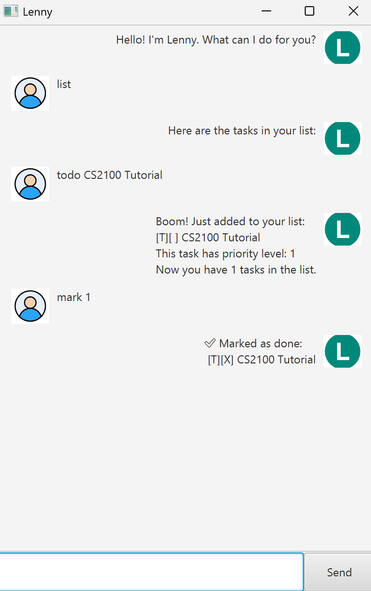

# Lenny User Guide



> *Lenny* is a simple, text-based task management assistant.  
> It helps you add, list, search, and update tasks from the command line with an intuitive set of commands.


## ➕ Adding Tasks

Add new tasks to your list. Tasks can be of three types: `todo`, `deadline`, and `event`.

Each command creates a task and confirms it has been added successfully.

Example: `todo <description>`

Example: `deadline <description> /by <date>`

Example: `event <description> /from <start> /to <end>`

Expected outcome: A new task is added to your task list and displayed back to you.

```
Input: 
todo read book
Expected output: 
Got it. I've added this task:
[T][ ] read book
Now you have 1 task in the list.

Input:
deadline submit report /by 2025-09-30
Output:
Got it. I've added this task:
[D][ ] submit report (by: 2025-09-30)

Input:
event team meeting /from 2025-09-21 14:00 /to 2025-09-21 16:00
Output:
Got it. I've added this task:
[E][ ] team meeting (from: 2025-09-21 14:00 to: 2025-09-21 16:00)
```
## 🔝 Prioritizing Tasks

Assign a priority level (e.g., 1–5) to a task. In GUI, this is a window that pops after adding a task. In CLI, this comes in after an accepted description of a task.

Example: `priority <task number> <level>`

Expected outcome: The task is updated with a priority indicator.

```
Input:
deadline project tasks /by Sunday 3pm
Output:
Enter task priority (1–5): 
Input:
3
Output:
Boom! Just added to your list:
[T][ ] go home
This task has priority level: 3
Now you have 3 tasks in the list.
```

## 📋 Listing Tasks

Show all tasks currently in your list.

Example: `list`

Expected outcome: Lenny displays all tasks with their type, completion status, and details.

```
Input:
list
Output:
Here are the tasks in your list:
1.[T][ ] read book
This task has priority level:3
2.[D][ ] submit report (by: 2025-09-30)
This task has priority level:5
3.[E][ ] team meeting (from: 2025-09-21 14:00 to: 2025-09-21 16:00)
This task has priority level:2
```


## ✅ Marking Tasks

Mark a task as completed.

Example: `mark <task number>`

Expected outcome: The chosen task is updated with `[X]` to indicate completion.

```
Input:
mark 1
Output:
Nice! I've marked this task as done:
[T][X] read book

```
## 🔄 Unmarking Tasks

Unmark a completed task (set it back to incomplete).

Example: `unmark <task number>`

Expected outcome: The chosen task is updated with `[ ]` to indicate it is incomplete.

```
Input:
unmark 1
Output:
OK, I've marked this task as not done yet:
[T][ ] read book
```

## ❌ Deleting Tasks

Remove a task from the list.

Example: `delete <task number>`

Expected outcome: The selected task is removed from the list.

```
Input:
delete 2
Output:
Noted. I've removed this task:
[D][ ] submit report (by: 2025-09-30)
Now you have 2 tasks in the list.
```
## 🔍 Finding Tasks

Search for tasks containing a keyword in their description.

Example: `find <keyword>`

Expected outcome: Lenny shows only tasks that match the keyword.

```
Input:
find book
Output:
🔍 Detective mode activated... here’s what I dug up:
1.[T][ ] read book
This task has priority level: 2
```
## 👋 Exiting

Exit the program.

Example: `bye`

Expected outcome: Program ends with a farewell message.

```
Input:
bye
Output:
Bye. Hope to see you again soon!
```